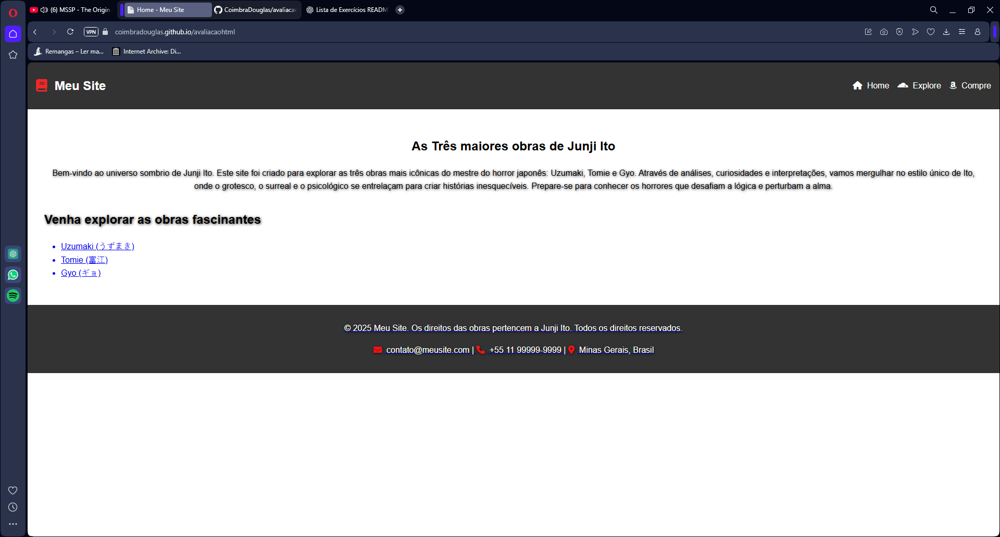
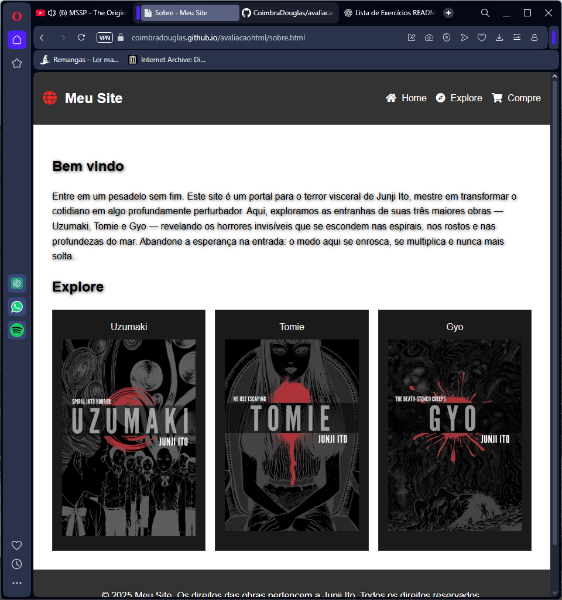

# 🌐 Avaliação 01 — Programação Web

**Disciplina:** Programação Web  
**Instituição:** Centro Universitário Newton Paiva  
**Curso:** Análise e Desenvolvimento de Sistemas  

---

## 🧾 Descrição do Projeto

Este projeto foi desenvolvido como parte da avaliação da disciplina **Programação Web**, com o objetivo de aplicar os conceitos fundamentais de **HTML5** e **CSS3** na criação de um site completo, responsivo e estilizado.  

O tema que eu escolhi foi **“As Três Maiores Obras de Junji Ito”**, uma homenagem ao mestre do horror japonês.  
O site apresenta informações sobre suas principais obras — *Uzumaki*, *Tomie* e *Gyo* — combinando estrutura semântica, design limpo e efeitos visuais sutis para melhorar a experiência do usuário.

Para acessar o site: https://coimbradouglas.github.io/avaliacaohtml/
---

## 🖥️ Estrutura do Projeto


```
📁 Projeto-JunjiIto/
│
├── index.html # Página inicial com introdução e navegação
├── sobre.html # Página com informações detalhadas sobre as obras
├── contato.html # Página de contato com formulário interativo
│
├── 📁 style/
│ └── style.css # Folha de estilos principal (CSS)
│
└── 📁 assets/
└── imagens/ # Imagens e ícones usados no site
```

---

## 🎨 Tecnologias Utilizadas

- **HTML5:** estrutura semântica e navegação entre páginas.  
- **CSS3:** estilização, layout responsivo e animações.  
- **Font Awesome:** ícones decorativos e funcionais no cabeçalho e rodapé.  
- **Responsividade:** otimizado para diferentes tamanhos de tela via `@media queries`.  

---

## 💡 Funcionalidades e Elementos Principais

- **Cabeçalho fixo com navegação:**  
  Ícones e links organizados horizontalmente para facilitar o acesso entre páginas.  

- **Seções de conteúdo:**  
  - *Welcome:* introdução ao universo de Junji Ito.  
  - *Features:* lista de obras com links interativos.  

- **Rodapé informativo:**  
  Contém dados de contato fictícios e direitos autorais.  

- **Animações e transições CSS:**  
  - Efeito de *hover* em links e cards.  
  - Transições suaves e escala em elementos interativos.  
  - Animação de bolhas flutuantes (`.bubbles`) como fundo decorativo.  

- **Design responsivo:**  
  O layout se adapta automaticamente a dispositivos móveis, reduzindo colunas e reorganizando o conteúdo.

---

## 🧠 Conceitos Aplicados

- Estrutura semântica HTML (header, main, section, footer)  
- Estilos em cascata e herança no CSS  
- Flexbox e Grid Layout  
- Transições, animações e efeitos de sombra  
- Responsividade e design adaptativo  
- Boas práticas de organização de arquivos e código limpo  

---

## 📸 Demonstração


1.Tela inicial do site


2.Tela de consulta do site



📚 Conclusão
Este projeto demonstra a integração entre estrutura, estilo e interatividade, pilares fundamentais do desenvolvimento web moderno.
Através da criação de um site temático, foi possível consolidar conhecimentos de HTML, CSS, animações, responsividade e design visual.

✍️ Desenvolvido por Douglas Coimbra
🎓 Centro Universitário Newton Paiva — 2025

